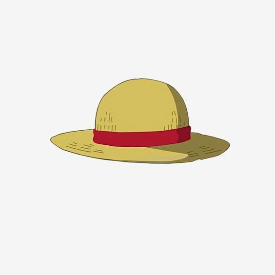

<a name="readme-top">

<br/>

<br />
<div align="center">
  <a href="https://github.com/Joshish01/">
  <!-- TODO: If you want to add logo or banner you can add it here -->
    
  </a>
<!-- TODO: Change Title to the name of the title of your Project -->
  <h3 align="center">Seatwork 4</h3>
</div>
<!-- TODO: Make a short description -->
<div align="center">
  Short Description. (Optional)
</div>

<br />

<!-- TODO: Change the zyx-0314 into your github username  -->
<!-- TODO: Change the WD-Template-Project into the same name of your folder -->


---

<br />
<br />

<!-- TODO: If you want to add more layers for your readme -->
<details>
  <summary>Table of Contents</summary>
  <ol>
    <li>
      <a href="#overview">Overview</a>
      <ol>
        <li>
          <a href="#key-components">Key Components</a>
        </li>
        <li>
          <a href="#technology">Technology</a>
        </li>
      </ol>
    </li>
    <li>
      <a href="#rule,-practices-and-principles">Rules, Practices and Principles</a>
    </li>
    <li>
      <a href="#resources">Resources</a>
    </li>
  </ol>
</details>

---

## Overview

<!-- TODO: To be changed -->
<!-- The following are just sample -->
This Project is about 2 Different feature display layout.

### Key Components
<!-- TODO: List of Key Components -->
<!-- The following are just sample -->
- MultiPage Website/Single Page Website
- Parallax transition
- Transactional
- Hover effects
- After effects

### Technology
<!-- TODO: List of Technology Used -->


## Rules, Practices and Principles
1. Always use `WD-` in the front of the Title of the Project for the Subject followed by your custom naming.
2. Do not rename any .html files; always use `index.html` as the filename.
3. Place Files in their respective folders.
4. All file naming are in camel case.
   - Camel case is naming format where there is no white space in separation of each words, the first word is in all lower case while the succeding words first letter are in upper followed by lower cased letters.
   - ex.: buttonAnimatedStyle.css
5. Use only `External CSS`.
6. Renaming of Pages folder names are a must, and relates to what it is doing or data it holding.
7. File Structure to follow below.

```
WD-ProjectName
└─ assets
|   └─ css
|   |   └─ style.css
|   └─ img
|   |   └─ fileWith.jpeg/.jpg/.webp/.png
|   └─ js
|       └─ script.js
└─ pages
|  └─ pageName
|     └─ assets
|     |  └─ css
|     |  |  └─ style.css
|     |  └─ img
|     |  |  └─ fileWith.jpeg/.jpg/.webp/.png
|     |  └─ js
|     |     └─ script.js
|     └─ index.html
└─ index.html
└─ readme.md
```

## Resources

<!-- TODO: Add References -->
| Title | Purpose | Link |
|-|-|-|
| logo | used logo for readme | https://ph.pinterest.com/pin/965599976332146070/ |
| background | used bg for landing page | https://ph.pinterest.com/pin/22236591905495121/
| feature 1 img | used bg for hero section feature 1 | https://ph.pinterest.com/pin/35395547062054085/
| feature 1 img | used for img gallery | https://ph.pinterest.com/pin/1055599906822671/
| feature 1 img | used for img gallery | https://ph.pinterest.com/pin/539306124139258336/
| feature 1 img | used for img gallery | https://ph.pinterest.com/pin/5277724555403364/
| feature 1 img | used for img gallery | https://ph.pinterest.com/pin/4644405856973370/
| feature 1 img | used for img gallery | https://ph.pinterest.com/pin/3588874695869795/
| feature 1 img | used for img section 1 | https://ph.pinterest.com/pin/708683691386684518/
| feature 1 img | used for img section 2 | https://ph.pinterest.com/pin/30258628741719444/
| feature 1 img | used for img section 3 | https://ph.pinterest.com/pin/476326098107945458/
| feature 2 img | used img for car 1 | https://ph.pinterest.com/pin/885238870491146177/
| feature 2 img | used img for car 2 | https://ph.pinterest.com/pin/1006202741732563867/
| feature 2 img | used bg for hero section feature 2 | https://ph.pinterest.com/pin/16325617393810559/
| feature 2 img | used img for car 3 | https://ph.pinterest.com/pin/743868063483002801/
| toyota | used for my feature 2 texts | https://www.headquartertoyota.com/blogs/2694/toyota-information/benefits-of-buying-new-and-pre-owned-toyotas/


